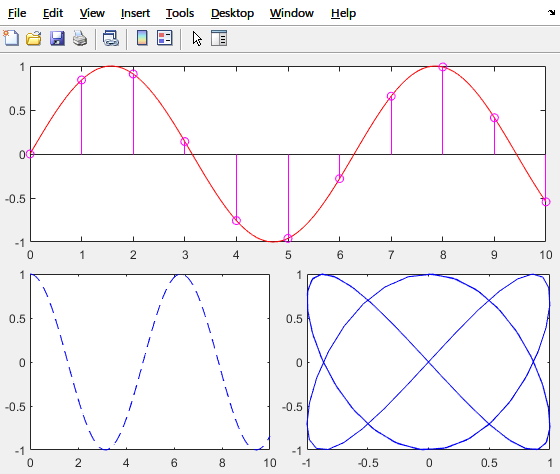

# Matlab-Scripts
Some useful matlab scripts/functions that can boost the productivity.


# tsubplot.m

The original plots created by matlab own rather large marings and gaps, and disappoint me when I want to export for
other usages, either bitmaps or vector graphs. And there are several solutions to it.

1. [subplot\_tight](https://blogs.mathworks.com/pick/2012/12/21/figure-margins-subplot-spacings-and-more/)
2. [Axes LooseInset property](https://undocumentedmatlab.com/articles/axes-looseinset-property)

But they are kind of unfavourable for me. So I write this `tsubplot` function, which resembls the original `subplot`
function in Matlab distributions.


## example

```matlab
t = 0:0.1:10;
tsubplot(211);                       % subplot 1
plot(t, sin(t), '-r');
tsubplot(2,2,3);                     % subplot 2
plot(t, cos(t), '--b');
tsubplot(2,2,4);                     % subplot 3
plot(sin(2*t), cos(3*t), '-b');

% And again, draw on the first Axes
tsubplot(2,1,1);
hold on;
t = 0: 1 : 10;
stem(t, sin(t), 'm');
```

This results into:



vim: tw=120
